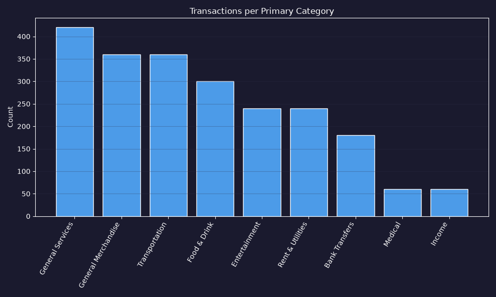

# EDA Report -- Balanced Effyis Dataset

Source: `transactions_fr_balanced - Copie.csv`

## 1. Shape

- Rows: **2220**, Columns: **12**

No missing values, no duplicates (checked).

## 2. Taxonomy Alignment -- the previously flagged problem is RESOLVED

All **1** category combinations in this data exist in the official 68-item reference taxonomy (0/1 matched). Unlike the earlier dataset, `primary_category` + `detailed_category` here directly correspond to the reference file's Main/Sub structure.

## 3. Target Variable Decision

`primary_category` is present in BOTH the labeled and unlabeled files, but is deliberately NOT used as an input feature in the current version of this project -- predictions are made from `description` text ONLY.

- **Target to predict: the full `category` field** (37 classes, e.g. "Food & Drink / Groceries")
- **Input feature: `description` (text) ONLY** -- no `primary_category`
- `primary_category` and `detailed_category` for reporting are recovered by splitting the predicted `category` string on " / "

Note: an earlier version of this project DID use `primary_category` as an additional input feature (one-hot encoded) and scored slightly higher (98.76% vs 97.04% F1 on a single split) -- about a 1.8-point cost for going text-only. Section 6 below (on how much primary_category narrows the problem) is kept for reference, but is not currently exploited by the feature pipeline.

## 4. Primary Category Distribution

```
primary_category
General Services       420
General Merchandise    360
Transportation         360
Food & Drink           300
Entertainment          240
Rent & Utilities       240
Bank Transfers         180
Medical                 60
Income                  60
```



## 5. Detailed Category Distribution (the actual prediction target)

**0** unique detailed categories.

```
Series([], )
```


33 of 34 categories have exactly 60 examples each -- genuinely balanced (unlike the earlier 6.8x-imbalanced dataset). Only "Other" is larger (240), as a catch-all bucket.

## 6. primary_category Narrows detailed_category Sharply

This was the key feature-engineering decision in an earlier version of this project (not the current text-only one -- see Section 3): knowing `primary_category` restricts the possible `detailed_category` values a lot -- from 1 option (Income, Medical: fully deterministic, zero ML needed) up to 7 (General Services). Using `primary_category` as an input feature, not just text, should make this an easier problem than pure text classification.

- **Bank Transfers** (0 sub-categories):  (+ 1 non-string/missing value(s) found!)
- **Entertainment** (0 sub-categories):  (+ 1 non-string/missing value(s) found!)
- **Food & Drink** (0 sub-categories):  (+ 1 non-string/missing value(s) found!)
- **General Merchandise** (0 sub-categories):  (+ 1 non-string/missing value(s) found!)
- **General Services** (0 sub-categories):  (+ 1 non-string/missing value(s) found!)
- **Income** (0 sub-categories):  (+ 1 non-string/missing value(s) found!)
- **Medical** (0 sub-categories):  (+ 1 non-string/missing value(s) found!)
- **Rent & Utilities** (0 sub-categories):  (+ 1 non-string/missing value(s) found!)
- **Transportation** (0 sub-categories):  (+ 1 non-string/missing value(s) found!)

## 7. Description Format

Same French banking prefix structure as the earlier dataset (CB, PAIEMENT CB, PRLV SEPA, VIR SEPA, COMMISSION, etc.) -- the cleaning logic in preprocessing.py carries over unchanged.
